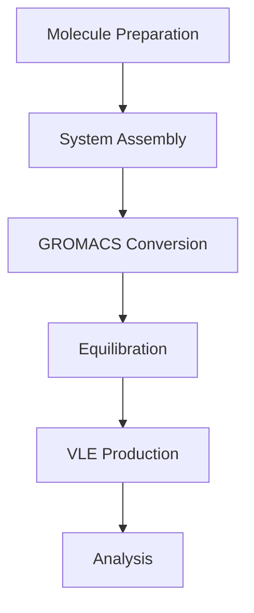

# README: VLE Simulation of Binary Mixtures using AmberTools and GROMACS

## Table of Contents
1. [Introduction](#introduction)
2. [Workflow Overview](#workflow-overview)
3. [Prerequisites](#prerequisites)
4. [Repository Structure](#repository-structure)
5. [Getting Started](#getting-started)
6. [Example: Methanol-Propanol System](#example-methanol-propanol-system)
7. [Analysis](#analysis)
8. [Troubleshooting](#troubleshooting)
9. [Citation](#citation)
10. [License](#license)

## Introduction <a name="introduction"></a>
This repository provides a comprehensive workflow for simulating Vapor-Liquid Equilibrium (VLE) of binary organic mixtures using molecular dynamics. The methodology combines AmberTools for molecular parameterization and system building with GROMACS for production simulations. 

**Full Documentation**: [Documentation.pdf](https://github.com/Thyco5/gromacs_vle/blob/main/Documentation.pdf)

## Workflow Overview <a name="workflow-overview"></a>


1. **Molecule Preparation**: Parameterization using AmberTools (`antechamber`, `parmchk2`)
2. **System Assembly**: Packing with Packmol and topology generation with `tleap`
3. **GROMACS Conversion**: Using InterMol for format conversion
4. **Equilibration**: Energy minimization, NVT, and NPT protocols
5. **VLE Production**: Slab geometry setup and long NVT simulation
6. **Analysis**: Density profiles, phase compositions, and vapor pressure calculation

## Prerequisites <a name="prerequisites"></a>
- AmberTools (tested with v22)
- GROMACS (tested with 2024.5)
- Packmol (tested with 20.15.1)
- InterMol (tested with 0.1.2)
- Python 3.x with NumPy, SciPy, Matplotlib
- Molecular visualization tools (VMD/PyMOL recommended)

## Repository Structure <a name="repository-structure"></a>
```
gromacs_vle/
├── Documentation.pdf           # Comprehensive guide
├── scripts/                    # Automation scripts
│   ├── phase1/                 # Molecule preparation
│   ├── phase2/                 # System building
│   ├── phase3/                 # Equilibration
│   ├── phase4/                 # VLE production
│   └── phase5/                 # Analysis
├── examples/                   # Sample input/output
│   ├── methanol_propanol/      # Example system
│   │   ├── input/              # Starting PDBs
│   │   ├── parameters/         # GAFF2 parameters
│   │   └── simulations/        # Simulation outputs
├── docs/                       # Documentation assets
└── LICENSE
```

## Getting Started <a name="getting-started"></a>
1. **Prepare molecular structures** (PDB format)
```bash
# Example: Create methanol.pdb and propanol.pdb
# Using Avogadro or similar software
```

2. **Parameterize molecules**:
```bash
cd scripts/phase1
./parameterize.sh methanol.pdb MOH 0  # For methanol (neutral)
./parameterize.sh propanol.pdb PRH 0  # For propanol (neutral)
```

3. **Build system**:
```bash
cd ../phase2
# Edit packmol.inp to specify composition
./build_system.sh 200 100  # 200 methanol, 100 propanol
```

4. **Run simulations**:
```bash
cd ../phase3
./run_equilibration.sh
cd ../phase4
./run_vle_simulation.sh
```

5. **Analyze results**:
```bash
cd ../phase5
./analyze_vle.sh
```

## Example: Methanol-Propanol System <a name="example-methanol-propanol-system"></a>
### System Composition
| Component      | Molecules | Residue Name |
|----------------|----------|-------------|
| Methanol (MOH) | 200      | MOH         |
| Propanol (PRH) | 100      | PRH         |

### Key Simulation Parameters
- Temperature: 298.15 K
- Pressure: 1.0 bar (NPT)
- Force Field: GAFF2
- Simulation Time: 20 ns (VLE production)

## Analysis <a name="analysis"></a>
After simulation, generate density profiles:
```bash
gmx density -f system_vle.xtc -s system_vle.tpr -d Z -o density_Z_MOH.xvg -sl 120
```

Example analysis scripts:
```python
# Plot density profile
import matplotlib.pyplot as plt
import numpy as np

z, density = np.loadtxt('density_Z_MOH.xvg', comments=['#','@'], unpack=True)
plt.plot(z, density)
plt.xlabel('Z-coordinate (nm)')
plt.ylabel('Density (kg/m³)')
plt.title('Methanol Density Profile')
plt.savefig('methanol_density.png')
```

## Troubleshooting <a name="troubleshooting"></a>
Common issues and solutions:

1. **PDB Formatting Errors**:
   - Symptom: `antechamber` fails with coordinate errors
   - Solution: Ensure strict PDB formatting (columns 31-54 for coordinates)

2. **Residue Recognition in tleap**:
   - Symptom: `tleap` can't assign parameters
   - Solution: Use unique 3-letter residue names (e.g., PRH instead of POL)

3. **GROMACS Topology Issues**:
   - Symptom: `grompp` fails with "No molecules defined"
   - Solution: Use InterMol conversion:  
     `python -m intermol.convert --amb_in mixture.prmtop mixture.inpcrd --gromacs`

4. **Simulation Instability**:
   - Symptom: LINCS warnings and crashes
   - Solution: Always perform energy minimization before dynamics

For complete troubleshooting guide, see [Documentation.pdf](Documentation.pdf)

## Citation <a name="citation"></a>
If you use this workflow in your research, please cite:
```bibtex
@manual{TorikhVLE2025,
  title = {VLE Simulation Workflow for Binary Mixtures},
  author = {Torikh, Mohammad},
  year = {2025},
  url = {https://github.com/Thyco5/gromacs_vle}
}
```

## License <a name="license"></a>
This project is licensed under the MIT License - see [LICENSE](LICENSE) for details.

---

For comprehensive documentation and theoretical background, refer to [Documentation.pdf](https://github.com/Thyco5/gromacs_vle/blob/main/Documentation.pdf). This includes detailed explanations of:
- Force field parameterization
- System building strategies
- Simulation protocols
- Analysis methodologies
- Complete troubleshooting guide
